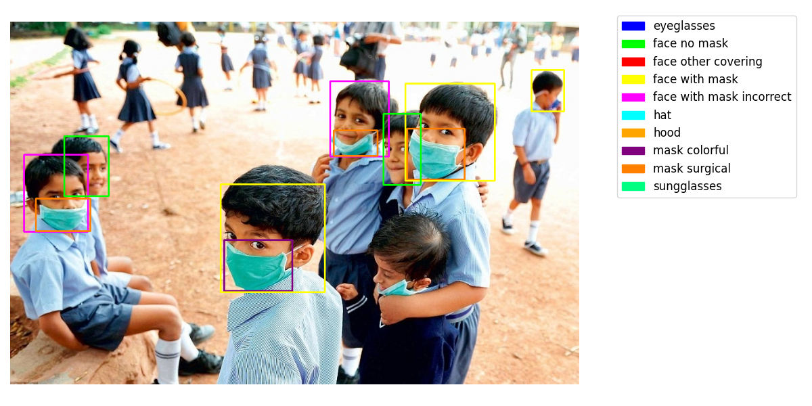
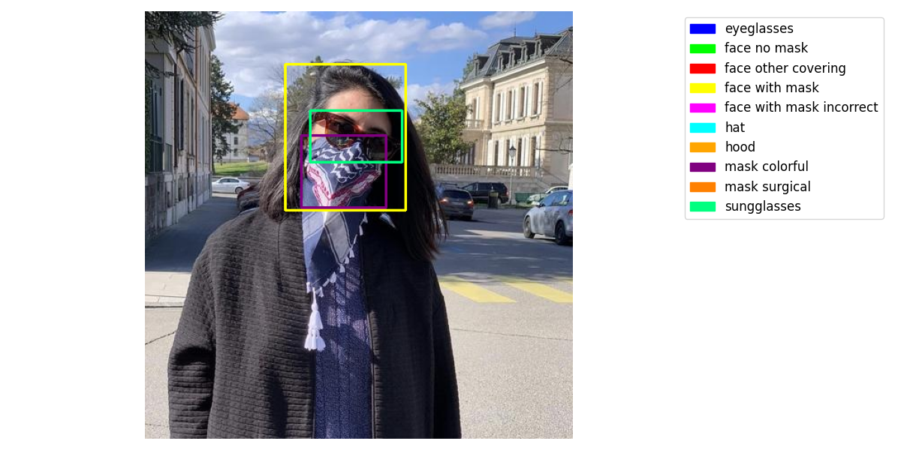
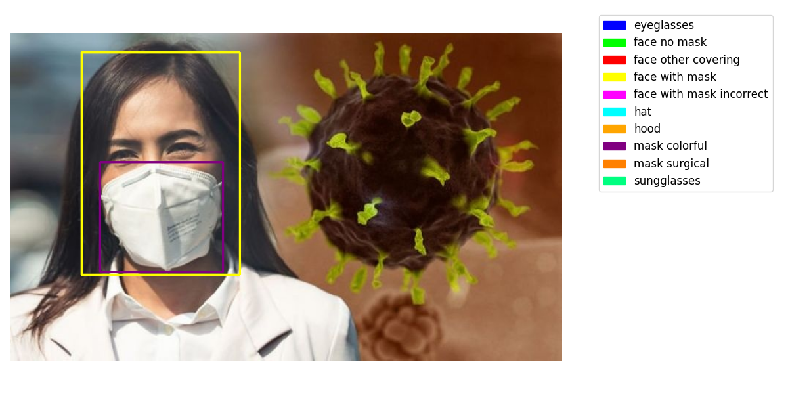

# Overview
This repository containts a Face Mask Detection Model using YOLOv8m from Ultralytics. The model is trained to detect 10 classes include:
* eyeglasses
* face no mask
* face other covering
* face with mask
* face with mask incorrect
* hat
* hood
* mask colorful
* mask surgical
* sungglasses

Kaggle notebook: https://www.kaggle.com/code/anhvinh/face-mask-detection

# Data
Training data from Kaggle: https://www.kaggle.com/datasets/wobotintelligence/face-mask-detection-dataset
The original dataset contains 4269 images and 20 different labels. For this project, I filtered the dataset to only include the 10 mentioned labels. 2605 images are used for training, 659 for validating.

# Evaluation
| Metric                     | Value    |
|----------------------------|----------|
| **Train Box Loss**         | 0.662    |
| **Train Class Loss**       | 0.349    |
| **Train DFL Loss**         | 1.026    |
| **Validation Box Loss**    | 0.985    |
| **Validation Class Loss**  | 0.602    |
| **Validation DFL Loss**    | 1.291    |
| **Validation Precision**   | 82.5%    |
| **Validation Recall**      | 79.9%    |
| **Validation mAP50**       | 83.7%    |
| **Validation mAP50-95**    | 58.6%    |

# Example result

# References
- Dataset: https://www.kaggle.com/datasets/wobotintelligence/face-mask-detection-dataset
